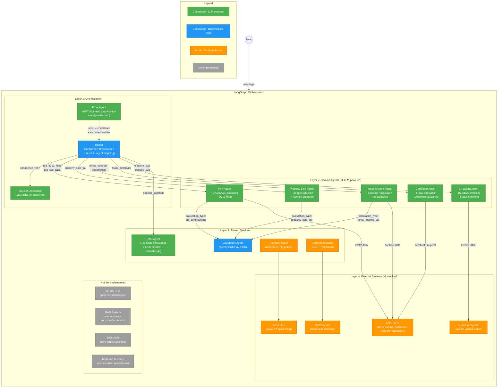
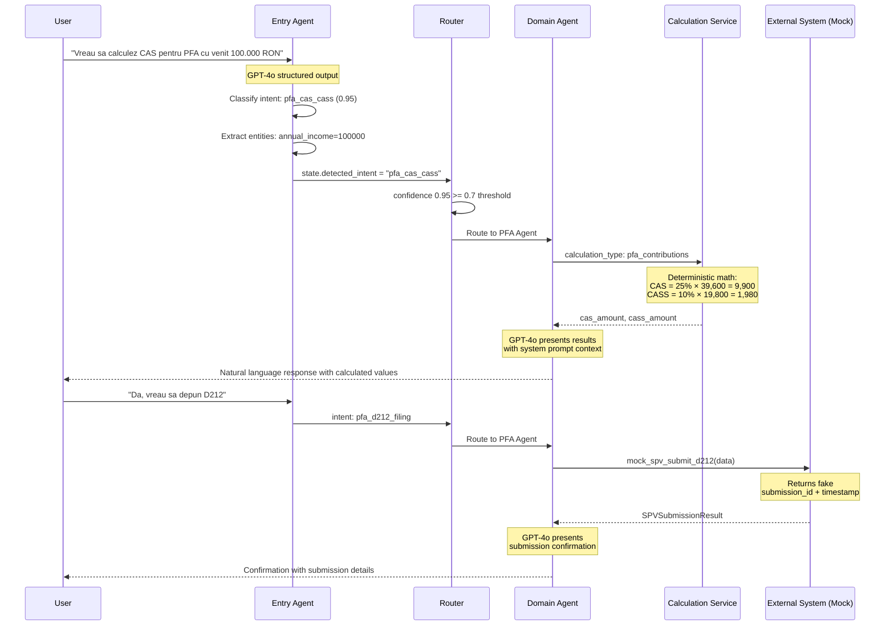
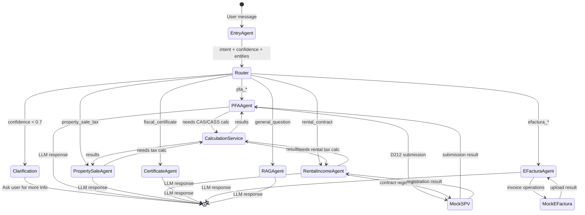
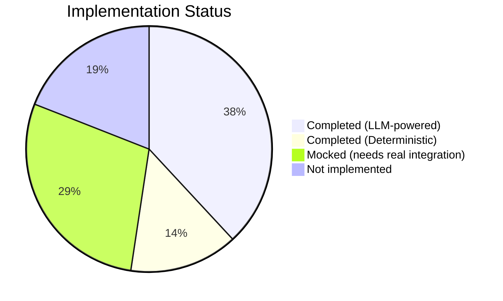
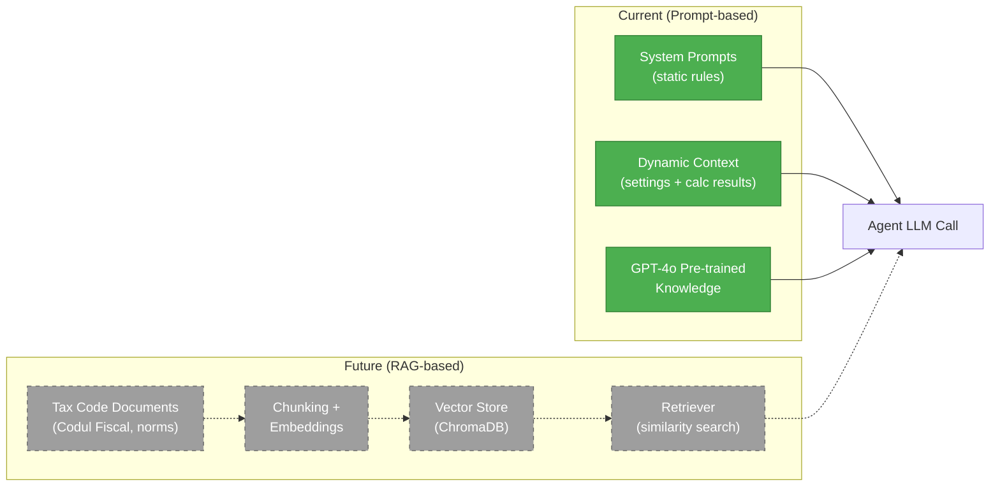

# Romanian Tax Multi-Agent System - Architecture

## System Overview

## Detailed Flow

## State Flow

## Completion Status

### Detailed Status

| Component | Status | Details |
|-----------|--------|---------|
| **Entry Agent** | ✅ Completed | GPT-4o structured output, intent classification, entity extraction |
| **Router** | ✅ Completed | Confidence-based routing, intent-to-agent mapping |
| **PFA Agent** | ✅ Completed | LLM-powered responses, CAS/CASS guidance, D212 flow |
| **Property Sale Agent** | ✅ Completed | LLM-powered, tax rate selection, payment guidance |
| **Rental Income Agent** | ✅ Completed | LLM-powered, contract registration flow |
| **Certificate Agent** | ✅ Completed | LLM-powered, certificate request flow |
| **E-Factura Agent** | ✅ Completed | LLM-powered, B2B/B2C, status checking |
| **RAG Agent** | ✅ Completed | LLM tax code expert (but no RAG - relies on GPT knowledge) |
| **Calculation Service** | ✅ Completed | Deterministic tax math (CAS/CASS/property/rental) |
| **Settings/Config** | ✅ Completed | Pydantic settings, tax rates, thresholds |
| **Validators** | ✅ Completed | CNP and CUI validation |
| **Document Intake** | 🟡 Mock | Uses mock OCR, no real document processing |
| **Payment Agent** | 🟡 Mock | Simulated Ghiseul.ro payments |
| **ANAF SPV** | 🟡 Mock | Fake D212 submission, certificate requests |
| **Ghiseul.ro** | 🟡 Mock | Fake payment processing |
| **E-Factura System** | 🟡 Mock | Fake invoice upload/status |
| **OCR** | 🟡 Mock | Returns hardcoded extracted data |
| **RAG / Knowledge Base** | ❌ Not built | No vector store, no tax code document ingestion |
| **UiPath RPA** | ❌ Not built | SDK mocked but no real automation |
| **User Authentication** | ❌ Not built | No real SPV login/sessions |
| **Multi-turn Persistence** | ❌ Not built | No conversation memory across sessions |

### Knowledge Source

